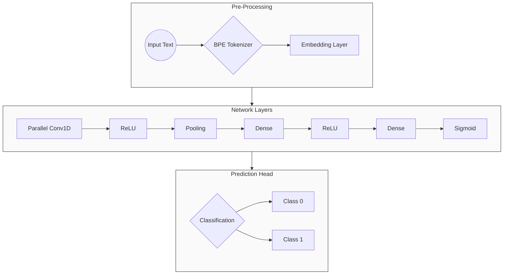

```
    ___       ___       ___       ___       ___       ___       ___       ___       ___   
   /\  \     /\  \     /\  \     /\__\     /\  \     /\  \     /\  \     /\  \     /\__\  
  _\:\  \   /::\  \   /::\  \   /:| _|_    \:\  \   /::\  \   /::\  \   /::\  \   /:/__/_ 
 /\/::\__\ /::\:\__\ /:/\:\__\ /::|/\__\   /::\__\ /:/\:\__\ /::\:\__\ /:/\:\__\ /::\/\__\
 \::/\/__/ \;:::/  / \:\/:/  / \/|::/  /  /:/\/__/ \:\/:/  / \;:::/  / \:\ \/__/ \/\::/  /
  \:\__\    |:\/__/   \::/  /    |:/  /   \/__/     \::/  /   |:\/__/   \:\__\     /:/  / 
   \/__/     \|__|     \/__/     \/__/               \/__/     \|__|     \/__/     \/__/  
        ___       ___       ___       ___       ___       ___       ___       ___   
       /\  \     /\  \     /\  \     /\  \     /\  \     /\  \     /\  \     /\  \  
      /::\  \>>>/::\  \   /::\  \>>>/::\  \   /::\  \>>>/::\  \   /::\  \>>>/::\  \ 
->   /::\:\__\ /::\:\__\>/::\:\__\ /::\:\__\>/::\:\__\ /::\:\__\>/::\:\__\ /::\:\__\ ->
->   \:\::/  / \:\::/  />\:\::/  / \:\::/  />\:\::/  / \:\::/  />\:\::/  / \:\::/  / ->
      \::/  />>>\::/  /   \::/  />>>\::/  /   \::/  />>>\::/  /   \::/  />>>\::/  / 
       \/__/     \/__/     \/__/     \/__/     \/__/     \/__/     \/__/     \/__/  
```

## IronTorch Convolutional Neural Network
### ***train embeddings***   
### ***text classification***

### To Run: 
```bash
git clone https://github.com/samAmabile/irontorch.git
cd irontorch
make

#to enter data manually:
./itorch

#to compile with inline data specifications:
./itorch <filename.csv> [data column name] [label column name] ['text'/'code'] ['pretrain']
```

### Details

#### Layer Architecture: 

##### Classifier Layers:
* Embedding 
* Parallel Conv1D: 
    runs 2 parallel conv1d with kernel sizes 5 and 7, then merges the resulting matrices
* ReLU: 
    uses leaky ReLU to softly linearize
* Pooling: 
    Max and Average Pooling
* Dense 
* ReLU 
* Dense 
* Sigmoid



##### Next-Token Prediction Layers:
* Embedding
* Conv1D
* ReLU
* Conv1D
* ReLU
* Dense
* ReLU
* Dense
* Softmax

#### Embeddings: 

Experimenting with using NTP training to create embeddings with some meaning encoded before classification. The idea is similar to the standard use of GloVe or Word2Vec to create embeddings to pass to the neural network, but using the same CNN to both create embeddings and fit BPE from the training split of the data, then pass the embeddings to the classifier. In theory, the NTP process will find meaningful connections in the text that will make classification more accurate. Like giving the model some domain-specific background context before training it to predict anything. 

* to create pre-trained embeddings run with 'pretrain' as the final inline argument, otherwise leave it out. 
**Training embeddings using NTP takes much longer than just training a classifier**


    
